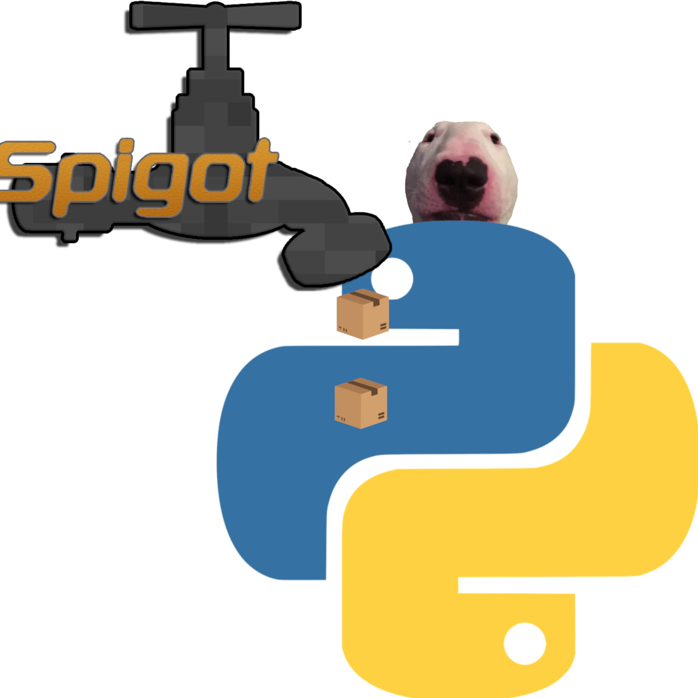

# WatonPlugin

    

## 
This plugin allows other programs to send and receive
messages and other events from a Minecraft server.
It can be used, for example, to connect a Discord server
chat with that of your Minecraft server via a Discord bot.
It doesn't require opening ports, and it can work on
any host.

## Installation
- Download [ProtocolLib](https://www.spigotmc.org/resources/protocollib.1997/)
- Place this and ProtocolLib's jars in your server's plugins folder
- Restart the server

## Connecting
The only thing any compatible app needs to connect is
the authorization token. It is generated for you when
you start the server and can be found in the config file
(`plugins/WatonPlugin/config.yml`).

To develop apps for this plugin, use
[WatonAPI](https://github.com/Waton-Corp/WatonAPI)

## Configure
Config settings can be found in `config.yml`.
You can currently configure:
- The formatting of received messages
- The authorization token
